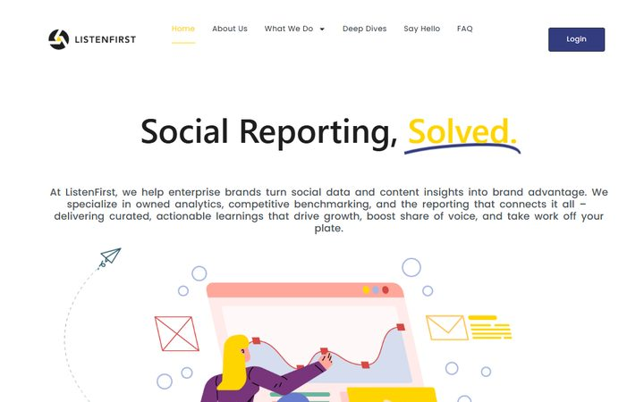
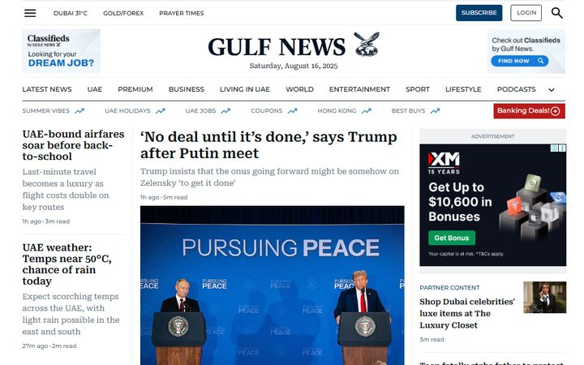
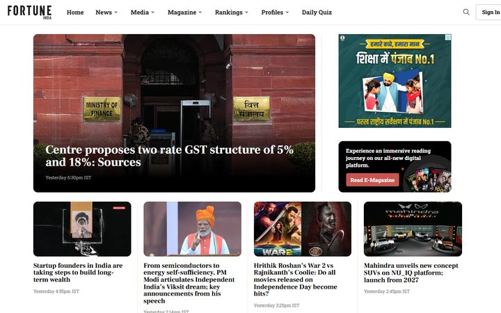
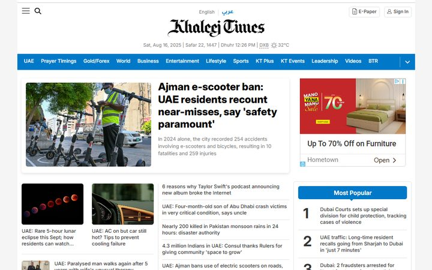
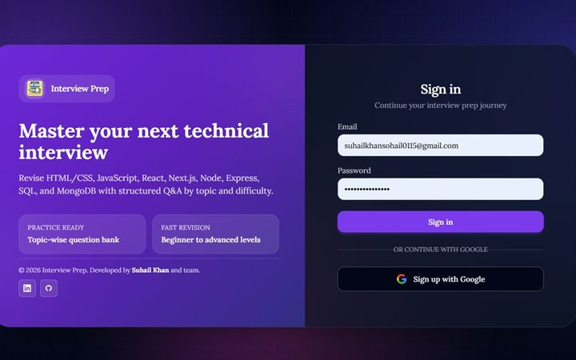
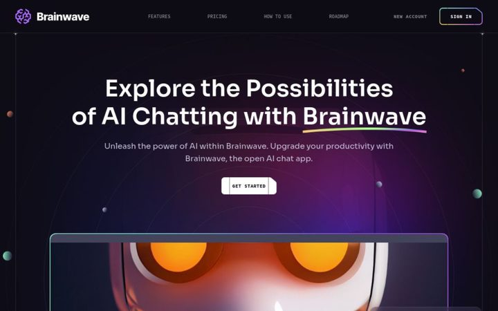
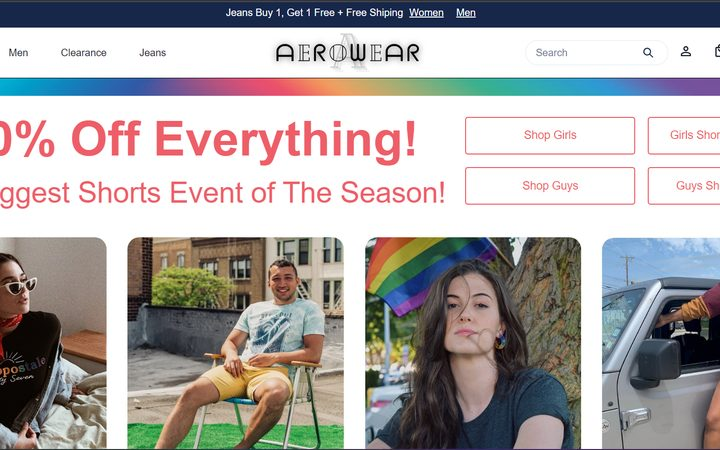
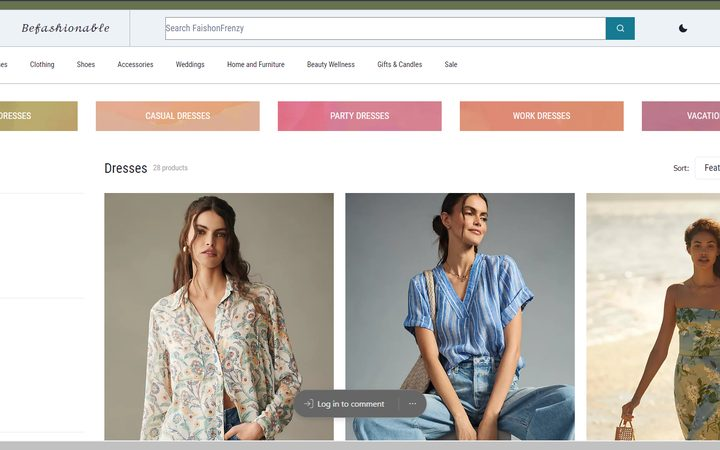
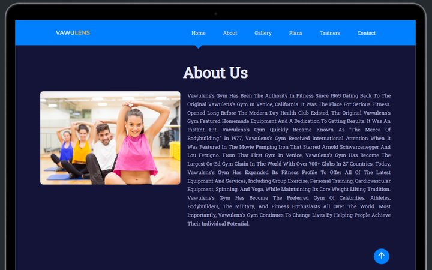

  <h1 align="center">Hi , I'm Suhail Khan</h1>
<h3 align="center">Senior Full Stack Developer — React, Next.js, Node.js, Ruby on Rails</h3>

  

  

          
      

  

<picture> </picture>

 

  
  
    

-    Senior Software Engineer at **Quintype**, building publishing platforms for Gulf News, Fortune India and Khaleej Times
-    Portfolio **<a href="https://www.suhailkhandev.site/">suhailkhandev.site</a>** — available for freelance projects
-    I'm a <a href="https://www.linkedin.com/school/masai-school/">**Masai**</a> School alumni.
-    Join me on LinkedIn <a href="https://www.linkedin.com/in/suhail-khan-dev/">**suhail khan**</a>
-    How to reach me **khansohail015@gmail.com**

## Connect with me:

 

## 🔣 Languages and Tools:

## 💼 Client Work :

Shipped in a team at Quintype — production platforms, no public source.

<table>
<tr>
<td width="50%" valign="top">

<h3>ListenFirst Media</h3>

Enterprise media analytics platform. Data-heavy dashboards, API-driven visualizations and production reliability, in sync with a U.S.-based team.

<b>React · Redux · D3.js · Ruby on Rails · PostgreSQL · TypeScript · AWS</b>

<a href="https://listenfirstmedia.com">🔗 Live site</a>

</td>
<td width="50%" valign="top">

<h3>Gulf News</h3>

Custom front end for a high-traffic news portal — performance, accessibility and cross-platform responsiveness.

<b>React · JavaScript · Node.js · Docker</b>

<a href="https://gulfnews.com">🔗 Live site</a>

</td>
</tr>
<tr>
<td width="50%" valign="top">

<h3>Fortune India</h3>

Responsive front end for a leading business magazine, built alongside backend devs and UI/UX designers.

<b>React · Node.js · JavaScript · Docker</b>

<a href="https://fortuneindia.com">🔗 Live site</a>

</td>
<td width="50%" valign="top">

<h3>Khaleej Times</h3>

Backend automation: JSON-to-XML conversion, secure FTP transfer of daily print editions, CI/CD with CircleCI.

<b>Node.js · Express · XML · CircleCI · Elasticsearch</b>

<a href="https://khaleejtimes.com">🔗 Live site</a>

</td>
</tr>
</table>

## 📂 Projects :

<table>
<tr>
<td width="50%" valign="top">

<h3>Interview Prep</h3>

MERN app for technical interview revision — a topic-wise question bank from beginner to advanced, with email and Google sign-in.

<b>React · Node.js · Express · MongoDB · Google OAuth</b>

<a href="https://mern-interview-preparation.vercel.app/login">🔗 Live demo</a>

</td>
<td width="50%" valign="top">

<h3>Zakat Foundation <i>freelance</i></h3>

Responsive website UI built for a freelance client, focused on a clean and accessible experience.

<b>React · Ant Design · Chakra UI</b>

<a href="https://marvelous-churros-cf40d8.netlify.app/">🔗 Live demo</a> · <a href="https://github.com/suhail3535/zakat-foundation-frontend-freelance-project">💻 Source</a>

</td>
</tr>
<tr>
<td width="50%" valign="top">

<h3>Brainwave</h3>

Modern UI/UX landing experience — sleek design, smooth scroll animations and parallax.

<b>React · Tailwind CSS · JavaScript</b>

<a href="https://brainwave-ai-phi.vercel.app/">🔗 Live demo</a> · <a href="https://github.com/suhail3535/Brainwave_AI">💻 Source</a>

</td>
<td width="50%" valign="top">

<h3>AeroWear</h3>

Clothing store front end covering casual wear and accessories, with filtering, sorting and cart state in Redux.

<b>React · Redux · JSON Server · Chakra UI</b>

<a href="https://aerowear-suhail3535s-projects.vercel.app/">🔗 Live demo</a> · <a href="https://github.com/suhail3535/Aerowear">💻 Source</a>

</td>
</tr>
<tr>
<td width="50%" valign="top">

<h3>Fashion Frenzy</h3>

Full-stack e-commerce store modelled on Anthropologie — product catalogue, cart and checkout flow.

<b>React · Redux · Node.js · Express · MongoDB</b>

<a href="https://faishonfrenzyecom.vercel.app/">🔗 Live demo</a>

</td>
<td width="50%" valign="top">

<h3>Fitness World</h3>

Wellness app with tailored workout plans, nutrition tips and community features.

<b>React · Material UI · Chakra UI · JavaScript</b>

<a href="https://fitness-worldweb-app.vercel.app/">🔗 Live demo</a> · <a href="https://github.com/suhail3535/FitnessWorldwebApp">💻 Source</a>

</td>
</tr>
</table>

More at **[suhailkhandev.site](https://www.suhailkhandev.site/)**.

## 🔥 Streak stats :

  

<a href="https://github.com/suhail3535">

</a>

  
  

  [Suhail Khan](https://github.com/suhail3535)
